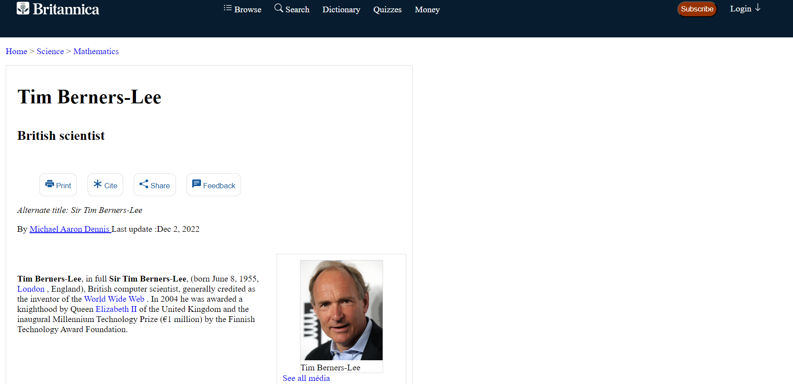
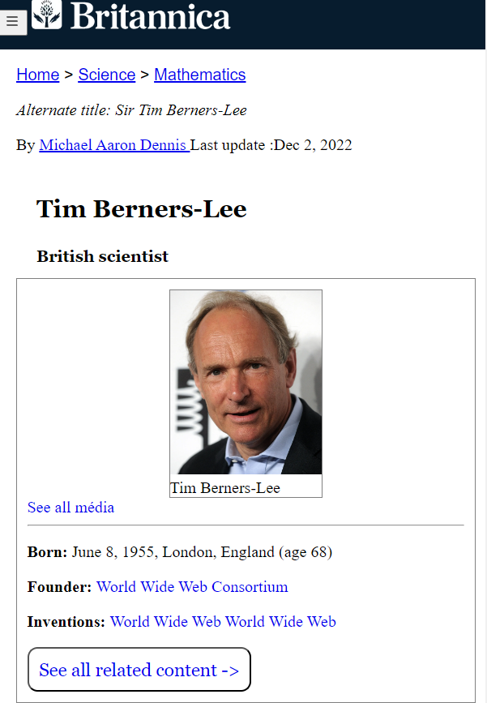

# Page Web en l'honneur de Tim Berners-Lee

Ce projet consiste en la création d'une page web dédiée à Tim Berners-Lee, l'inventeur du HTML. La page est réalisée en utilisant HTML5 et CSS3, et elle doit respecter un mockup prédéfini. Pour voir la page en action, consultez le lien ci-dessous.

[Page live](https://zanko19.github.io/tim-berners-lee/)

## Technologies Utilisées

- HTML5 : Utilisé pour créer la structure de base de la page web.
- CSS3 : Employé pour styliser et mettre en forme le contenu de la page web.
- Vite.js : Utilisé comme outil de développement pour la construction rapide de l'application web.

## Aperçu

### Version Desktop

### Version Mobile

## Auteur

- Guillaume Dedeurwaerder
- Date de Création : 12/10/23

### Source

- basée sur le mockup de l'excerice dans le cadre de la formation Junior Dev chez BeCode : [Exo_tim-berners-lee](https://github.com/becodeorg/Swartz-8/blob/main/1.The-Field/8.Html-CSS/tim-berners-lee.adoc)
